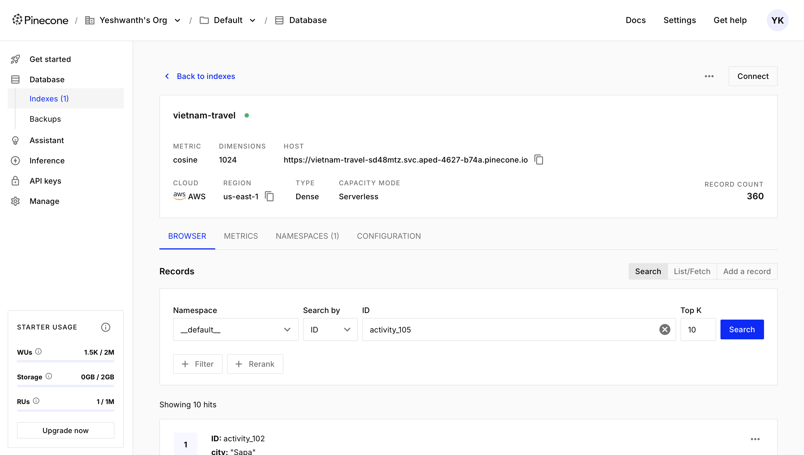
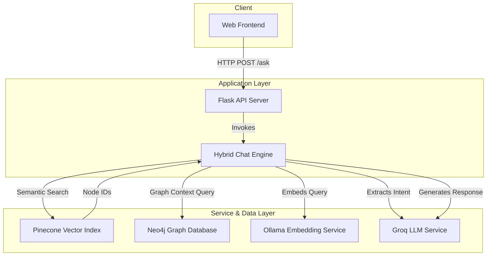

# Hybrid AI Travel Assistant

<p align="center">
  
</p>

## Project Overview

This repository contains the source code for a Retrieval-Augmented Generation (RAG) based AI travel assistant. The system is architected to provide contextually-aware travel recommendations by integrating multiple data retrieval strategies. It leverages semantic search over a vector database and contextual lookups in a graph database to build a comprehensive context for a large language model, which then generates the final user-facing response.

The project demonstrates a robust, end-to-end implementation of a hybrid RAG pipeline, complete with data ingestion scripts, a core logic engine, an API layer, and a user interface.

## System Architecture

The application follows a modular, multi-stage architecture to process user queries. The data flow is designed to enrich the initial query with relevant, multi-faceted context before the final generation step.

1. **User Interface (index.html)**: A web-based client captures user input.

2. **API Server (server.py)**: A Flask-based API receives POST requests from the client.

3. **Core Logic (hybrid_chat.py)**: This central module orchestrates the RAG pipeline:
   - **Intent Extraction**: An initial LLM call parses the natural language query into a structured format.
   - **Parallel Context Retrieval**:
     - **Vector Search**: The query is embedded using a local Ollama model, and a semantic search is performed against a Pinecone index to retrieve relevant documents.
     - **Graph Search**: Identifiers from the top vector search results are used to query a Neo4j graph database, fetching interconnected entities and relationships up to two hops away.
   - **Prompt Engineering**: The retrieved vector and graph contexts are structured and combined with the user query and conversation history into a detailed prompt.
   - **Response Generation**: The final prompt is sent to the Groq API to generate a coherent, context-aware response.

4. **Data Layer**:
   - **Pinecone**: A serverless vector database for storing and searching high-dimensional text embeddings.
   - **Neo4j**: A graph database modeling the relationships between travel entities (e.g., Hotel-[NEAR]->Attraction).

<p align="center">
  
</p>



## Key Technical Features

- **Hybrid RAG Pipeline**: Combines dense vector retrieval with structured graph traversal to build a superior context, mitigating the limitations of each approach in isolation.

- **Intent Extraction with Confidence Scoring**: The system first interprets the user's query to extract structured parameters (destination, budget, etc.), allowing for more precise context retrieval.

- **Semantic Reranking**: Implements a post-retrieval reranking step that boosts documents based on metadata keyword matches, improving the relevance of the context provided to the LLM.

- **Conversation Memory**: Maintains a stateful conversation history using a deque, enabling contextually relevant follow-up queries.

- **Local Embedding Generation**: Utilizes a local Ollama instance for text embeddings, ensuring data privacy and reducing reliance on external APIs.

- **Caching**: Employs an LRU cache for the embedding function to minimize latency and eliminate redundant computations on similar inputs.

## Technology Stack

- **Backend**: Python 3.9+, Flask
- **Frontend**: HTML5, CSS3, JavaScript (ES6)
- **Databases**:
  - Vector Database: Pinecone
  - Graph Database: Neo4j
- **AI Services**:
  - LLM Inference: Groq API (Llama 3.1 70B model)
  - Embedding Model: Ollama (mxbai-embed-large)
- **Key Libraries**: pinecone-client, neo4j, groq, requests, flask

## Setup and Deployment

### 1. Prerequisites

- Python 3.8 or higher
- Docker and Docker Compose
- An active Ollama instance
- API keys for Pinecone and Groq

### 2. Configuration

Clone the repository:

```bash
git clone https://github.com/your-username/hybrid-ai-travel-assistant.git
cd hybrid-ai-travel-assistant
```

Create and activate a Python virtual environment:

```bash
python3 -m venv venv
source venv/bin/activate
```

Install dependencies:

```bash
pip install -r requirements.txt
```

Configure environment variables by copying `config.py.example` to `config.py` and populating it with the required API keys and service URIs.

### 3. Service Initialization

Start the Neo4j container using Docker. The password must match the one specified in `config.py`:

```bash
docker run \
    --name neo4j-travel \
    -p 7474:7474 -p 7687:7687 \
    -d \
    -e NEO4J_AUTH=neo4j/YOUR_NEO4J_PASSWORD \
    neo4j:latest
```

Ensure the Ollama service is running and has downloaded the required model:

```bash
ollama pull mxbai-embed-large
```

### 4. Data Ingestion

Execute the provided scripts to populate the databases. This is a one-time setup process:

```bash
python load_to_neo4j_enhanced.py
python pinecone_upload.py
```

### 5. Running the Application

Start the Flask backend server:

```bash
python server.py
```

The API will be available at `http://127.0.0.1:5000`.

Launch the user interface by opening the `index.html` file in a web browser.

## Future Development

- **Docker Compose Orchestration**: Encapsulate all services (Neo4j, Flask app) in a `docker-compose.yml` for simplified, one-command deployment.

- **Real-time Data Integration**: Augment the existing dataset with real-time APIs for hotel availability, flight pricing, and weather forecasts.

- **User Authentication**: Implement user accounts to persist conversation history and personal travel preferences across sessions.

- **Scalability Enhancements**: Transition the Flask development server to a production-grade WSGI server like Gunicorn or uWSGI behind a reverse proxy like Nginx.
